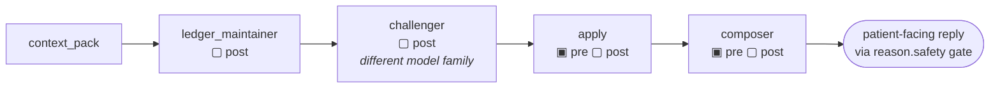
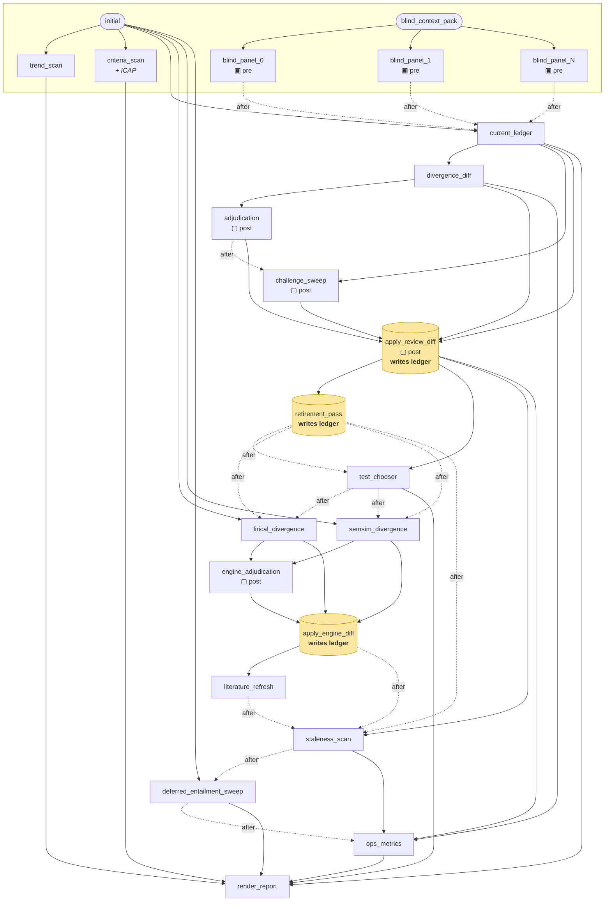

# The reasoning DAGs

Three loops run as explicit graphs with code-enforced contracts (`reason/dag.py`,
no framework). This page is generated from reading the builders, not from
memory — if it disagrees with the code, the code is right and this is stale.

Contract markers: **▣ pre** = precondition, **▢ post** = postcondition. A
violation stops the run immediately and nothing downstream executes.

## Diagnostic turn (`reason/stages.py`)

Four stages. Short, and the shape is honest.

The Challenger is mandatory and cross-family; the Composer's precondition
asserts a Challenger completed *this run*. Stage order is enforced here, not
in prompts.

## Deep review (`reason/review.py`)

Twenty nodes (three blind-panel members, per `models.yaml`). The panel members
are independent of one another; almost nothing else is.

Solid edges are **reads** (`depends_on`); dotted `after` edges are orderings
with no data flow — mostly the ledger and its history file on disk. Two
dotted clusters are also **parallel batches**: the panel members, and the two
engines. `render_report`'s eleven incoming edges are not clutter; that is how
many artifacts it reads, and only one of them used to be declared.

The blind panel's preconditions (`forbid_context_key("ledger")` and
`edge_payload_lacks_section("ledger")`) are the anchoring defence: no panel
member may see the differential it is meant to independently reproduce.

Three nodes write the ledger, each applying its own diff so the invariants get
to check it. Nothing gets a private back door.

## What drawing this revealed — and what was done about it

Three structural problems, hard to see in a 2,700-line builder and obvious
in a diagram. **All three are closed by [ADR 0043](adr/0043-the-declared-graph-is-the-real-graph.md).**
Kept here because the measurements are the reason the ADR exists.

### 1. `depends_on` was one edge, but nodes read many — fixed

A node declared a single upstream, and that edge was what got validated
against `input_model`. But `fn` receives the whole context and may read
anything in it, so the declared graph understated the real dependencies:

| node | declared | actually read |
|---|---|---|
| `apply_review_diff` | `challenge_sweep` | 4 nodes |
| `render_report` | `ops_metrics` | 10 nodes |
| `ops_metrics` | `deferred_entailment_sweep` | 3 nodes |
| `engine_adjudication` | `semsim_divergence` | 2 nodes |
| `apply_engine_diff` | `engine_adjudication` | 3 nodes |
| `staleness_scan` | `literature_refresh` | `apply_review_diff` only |

Eight of twenty read something they did not declare.

`depends_on` now takes a list and every entry is checked. A test parses this
builder's own source with `ast` and asserts no node reads a context key it
has not declared, so the table above cannot come back.

### 2. Execution was sequential, so the branching was decorative — fixed

`dag.run` iterated `dag.nodes` in list order. The N blind-panel members
depend only on `blind_context_pack` and are genuinely independent — three
serial `xhigh` frontier calls at the front of every review. The two engines
were the same story: LIRICAL at 76.9s, then sem-sim, neither reading the
other.

Order is now derived by topological sort, and `parallel_group` batches the
panel and the engines. The derived order is verified **identical** to the
order that shipped, which is what made deriving it safe: stage order is a
safety property (CLAUDE.md rule 3), so the change had to be provably
order-preserving before it could add anything.

### 3. A chain of twenty over a much shallower graph — fixed, with a correction

`current_ledger` depended on the *last* blind-panel node, so the graph's
shape depended on how many members `models.yaml` configures. It now declares
`initial` and `after=(every panel member)`.

**This document was wrong about the rest of it.** It called
`test_chooser → lirical_divergence → semsim_divergence` and
`literature_refresh → staleness_scan` "sequencing devices" between "stages
that share no data at all", and proposed deleting them. They share no data
and they are not deletable: `staleness_scan` reads
`ledger-history.jsonl`, which `retirement_pass` and `apply_engine_diff`
append to. Dropping the edge would have moved the scan earlier and silently
changed what it reads.

The orderings were real constraints expressed in the only vocabulary
available. `after` is that vocabulary, and each use of it carries a comment
naming the file that makes it real.

### The honest shape

A fan of independent scans and panel members; a serial ledger-mutation spine
(`divergence_diff` → `adjudication` → `challenge_sweep` → `apply` →
`retirement` → engines → `apply_engine_diff`) that genuinely must be ordered
because each step reads what the previous one wrote; and a reporting node
that reads everything. That is now what the declarations say.
