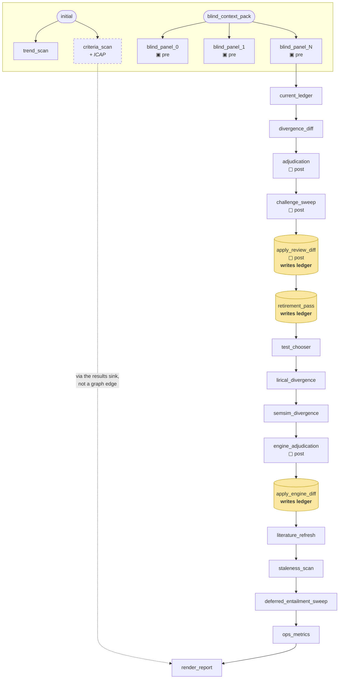

# The reasoning DAGs

Three loops run as explicit graphs with code-enforced contracts (`reason/dag.py`,
no framework). This page is generated from reading the builders, not from
memory — if it disagrees with the code, the code is right and this is stale.

Contract markers: **▣ pre** = precondition, **▢ post** = postcondition. A
violation stops the run immediately and nothing downstream executes.

## Diagnostic turn (`reason/stages.py`)

Four stages. Short, and the shape is honest.

The Challenger is mandatory and cross-family; the Composer's precondition
asserts a Challenger completed *this run*. Stage order is enforced here, not
in prompts.

## Deep review (`reason/review.py`)

Twenty nodes (three blind-panel members, per `models.yaml`). The panel members
are independent of one another; almost nothing else is.

The blind panel's preconditions (`forbid_context_key("ledger")` and
`edge_payload_lacks_section("ledger")`) are the anchoring defence: no panel
member may see the differential it is meant to independently reproduce.

Three nodes write the ledger, each applying its own diff so the invariants get
to check it. Nothing gets a private back door.

## What drawing this revealed

Three structural problems that are hard to see in a 2,700-line builder and
obvious in a diagram.

### 1. `depends_on` is one edge, but nodes read many

A node declares a single upstream, and that edge is what gets validated
against `input_model`. But `fn` receives the **whole context** and may read
anything in it. So the declared graph understates the real dependencies —
measured across the review DAG:

| node | declares | actually reads |
|---|---|---|
| `apply_review_diff` | `challenge_sweep` | 4 nodes |
| `render_report` | `ops_metrics` | 10 nodes |
| `ops_metrics` | `deferred_entailment_sweep` | 3 nodes |
| `engine_adjudication` | `semsim_divergence` | 2 nodes |
| `apply_engine_diff` | `engine_adjudication` | 3 nodes |
| `staleness_scan` | `literature_refresh` | `apply_review_diff` only |

Eight of the twenty nodes read something they do not declare. `staleness_scan`
is the clearest case: it declares `literature_refresh` and does not read it at
all — the edge exists purely to place the node in the sequence.

The consequence is not a runtime bug. It is that **the graph cannot be
trusted as documentation of data flow**, and a reordering that looks safe
against the declared edges can break an undeclared read.

### 2. Execution is sequential, so the parallelism in the graph is decorative

`dag.run` iterates `dag.nodes` in list order. The N blind-panel members depend
only on `blind_context_pack` and are genuinely independent — they are the one
place the graph branches — and they still run one after another. With the three
configured panel members at `xhigh` effort, that is three serial frontier
calls at the front of every review.

`trend_scan` and `criteria_scan` are likewise independent of everything until
`render_report`.

### 3. A chain of twenty where the dependencies are a much shallower graph

`current_ledger` depends on the *last* blind-panel node. That is not a data
dependency — it is a sequencing device, and which panel member it names
depends on how many are configured. Similarly `test_chooser` → 
`lirical_divergence` → `semsim_divergence` is a straight line between three
stages that share no data at all; the engines only need the ledger on disk.

The honest shape of the review is roughly: a fan of independent scans and
panel members, a serial ledger-mutation spine (`divergence_diff` →
`adjudication` → `challenge_sweep` → `apply` → `retirement` → engines →
`apply_engine_diff`) that genuinely must be ordered because each step reads
the ledger the previous one wrote, and a final reporting node that reads
everything.

### What would fix it

Not urgent — the review is a weekly batch and correctness does not depend on
it — but recorded so the next person does not have to rediscover it:

- Let `depends_on` take a **list**, and validate every declared edge. The
  single-edge design is what forces the false sequencing edges.
- Derive execution order by topological sort rather than list position; then
  independent nodes are visibly independent and the blind panel *could* be
  parallelised without reordering anything by hand.
- Make `criteria_scan` reach `render_report` through the graph rather than the
  `results` sink, so it stops being invisible to it.
