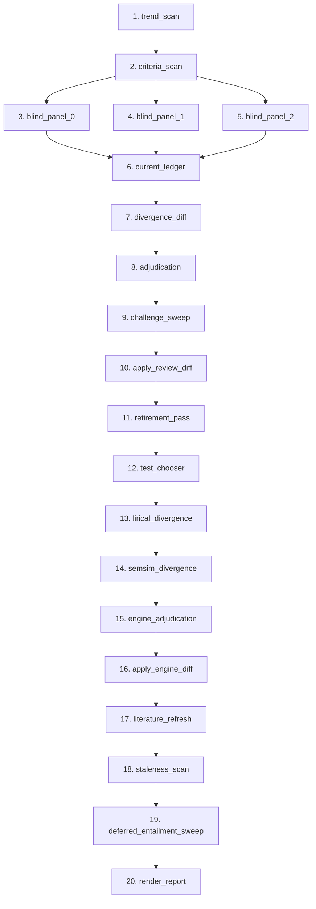

# Comprehensive System Review: a-doc

**Document Version:** 1.2  
**Review Scope:** Full Codebase, Clinical Architecture & Patient Experience Evaluation  
**Status Context:** Phase 3 Complete, Phase 4 Not Started  

---

## Executive Summary

The `a-doc` system implements an agentic clinical reasoning and case-management platform designed for complex, undiagnosed, or rare disease navigation. It couples deterministic safety gates, an append-only Git-backed case file, SQLite relational and full-text search indexing, and a multi-engine diagnostic hypothesis pipeline (incorporating LLMs from distinct model families, deterministic classification criteria scorers, LIRICAL likelihood-ratio phenotyping, and Monarch ontology semantic similarity).

This document provides three comprehensive evaluations with dedicated actionable fix items:
1. **Adversarial Developer Code Review (DEV-01 to DEV-14)**: A detailed, numbered technical inspection identifying concrete vulnerabilities, concurrency hazards, data-integrity edge cases, error-swallowing behaviors, and architectural flaws across the Python implementation.
2. **Clinical & Medical Architecture Review (CLN-01 to CLN-05)**: A physician-level diagnostic evaluation analyzing hypothesis production mechanisms, the directed acyclic graph (DAG) execution topologies, clinical validity, classification versus diagnostic criteria pitfalls, pharmacotherapy confounders, and concrete architectural resolution paths.
3. **Patient-Centric Experience & Actionable Interface Review (PAT-01 to PAT-08)**: A user-experience evaluation from the perspective of an undiagnosed or chronic disease patient navigating the system, contrasting real-time **Prompt Chat** with the **Weekly Deep Review**, identifying psychological friction, and specifying an actionable list of UI/UX and conversational fix items.
4. **Master Actionable Consolidation Matrix**: A unified tracking table mapping all 27 technical, clinical, and patient findings to their concrete remediation plans and target implementation phases.

---

# Section 1: Adversarial Developer Code Review

This section presents a rigorous developer review of the `src/adoc` codebase. Issues are ranked and detailed with specific failure modes, affected files, and recommended remediations.

---

### DEV-01. Pseudo-DAG Graph Topology: False Multi-Parent Dependency & Sequential Runtime Model
- **File(s):** `src/adoc/reason/dag.py` (lines 69–98, 196–289), `src/adoc/reason/review.py` (lines 2085–2210), `docs/dag-topology.md`
- **Severity:** High (Architectural Integrity & Correctness)
- **Description:** The `Node` abstraction defines `depends_on: str | None`, restricting each node to at most a single declared upstream dependency. In reality, multiple stages in the 20-node Deep Review DAG read outputs from multiple prior nodes via the untyped global `Ctx` dictionary (for example, `apply_review_diff` consumes outputs from `divergence_diff`, `adjudication`, `challenge_sweep`, and `current_ledger`; `render_report` reads 10+ distinct node outputs).
- **Failure Mode:** Because `dag.py::run()` executes nodes sequentially in array declaration order, the graph representation is a linear chain masquerading as a DAG. If a node fails or is skipped, nodes downstream that rely on its data through undeclared `Ctx` lookups crash with `KeyError` or operate on stale defaults. True parallel execution (such as concurrent execution of `blind_panel_0..N-1` or `lirical` / `semsim`) is impossible under the current runtime engine without major refactoring.
- **Remediation:** Refactor `Node.depends_on` to `tuple[str, ...]` or `set[str]`, validate dependencies against a topological sort with cycle detection, pass explicit typed inputs to node runners rather than an unrestricted shared mutable context dictionary, and execute independent branches via `asyncio.gather` or concurrent worker pools.

---

### DEV-02. S3 Backup Remote Source Scan Truncation & Unbounded PUT Costs
- **File(s):** `src/adoc/backup.py` (lines 105–110, 113–136)
- **Severity:** Medium-High (Operational & Cost Vulnerability)
- **Description:** In `run_backup()`, `_remote_source_sizes()` inspects existing files in S3 using a single unpaginated call:
  ```python
  response = s3.list_objects_v2(Bucket=bucket, Prefix=SOURCES_PREFIX)
  for obj in response.get("Contents", []):
      sizes[obj["Key"]] = obj["Size"]
  ```
  `list_objects_v2` returns a maximum of 1,000 objects per call. While the restore counterpart `_list_source_keys()` correctly follows pagination via `NextContinuationToken`, `_remote_source_sizes()` does not.
- **Failure Mode:** As soon as a patient's case repository grows past 1,000 archived source items (pages, images, documents, reports), any file indexed after the 1,000th object is missing from `sizes`. Consequently, every execution of `adoc backup` will unconditionally re-upload all source documents past index 1,000, wasting outbound network bandwidth, generating redundant S3 PUT operations, and creating continuous non-current versions in S3 buckets with versioning enabled.
- **Remediation:** Implement standard pagination using `NextContinuationToken` in `_remote_source_sizes()`, mirroring `_list_source_keys()`, or use boto3's `s3.get_paginator("list_objects_v2")`.

---

### DEV-03. Mount-Point Unlink Failure and Cross-Device Rename Errors in Restore Pipeline
- **File(s):** `src/adoc/backup.py` (lines 368–408), `docker-entrypoint.sh` (lines 14, 39–45)
- **Severity:** High (Availability & Disaster Recovery Failure)
- **Description:** During `restore_from_bucket()`, staging occurs in `staging_dir = data_dir.parent / (data_dir.name + ".restore-staging")`. Once extraction completes, the function attempts:
  ```python
  if data_dir.exists() and not any(data_dir.iterdir()):
      data_dir.rmdir()
  os.rename(staging_dir, data_dir)
  ```
- **Failure Mode:** 
  1. If `ADOC_DATA_DIR` is configured directly as a mount root (e.g. `/data` mounted directly to an AWS EFS Access Point or Docker named volume), calling `data_dir.rmdir()` will fail with `EBUSY` or `OSError: [Errno 16] Device or resource busy` because a filesystem mount root cannot be deleted.
  2. If `data_dir` and `data_dir.parent` reside on different mount points or temporary volumes, `os.rename()` will fail with `EXDEV` (`Invalid cross-device link`).
  3. If `ADOC_DATA_DIR` is `/data`, `data_dir.parent` is `/`, causing staging directory creation at `/.data.restore-staging`, which immediately fails with `PermissionError` under the unprivileged `adoc` container user (UID 1000).
- **Remediation:** Restore directly into the target `data_dir` using an internal temporary directory (e.g., `<data_dir>/.staging/`), moving contents across inside the existing mount root, or copy directory trees using `shutil.copytree(..., dirs_exist_ok=True)` and clean up staging rather than unlinking mount roots.

---

### DEV-04. SQLite Locking & Missing Busy Timeout Under Multi-Process ECS Deployments
- **File(s):** `src/adoc/labs/db.py` (lines 512–568), `deploy/cfn/ecs.yaml` (lines 120–280)
- **Severity:** High (Database Concurrency & Web Request Failure)
- **Description:** `LabsDb` uses `sqlite3.connect(str(path), check_same_thread=False)` and guards in-process thread concurrency with an internal `RLock`. However, the ECS architecture defines independent scheduled tasks (Scheduled Ingest every 10 minutes, Scheduled Review every 30 minutes, Nightly Backup) that execute in separate containers mounting the exact same EFS storage volume.
- **Failure Mode:** When a background ingest or review process performs batch writes on EFS with `ADOC_SQLITE_JOURNAL_MODE=TRUNCATE`, SQLite acquires a file-level write lock. Because `sqlite3.connect()` does not configure a custom `timeout` (defaulting to 5.0 seconds) and never executes `PRAGMA busy_timeout`, any concurrent web user request hitting `labs.sqlite` during an ingest or review transaction exceeding 5 seconds immediately crashes with `sqlite3.OperationalError: database is locked`.
- **Remediation:** Explicitly configure a resilient timeout during connection (`sqlite3.connect(..., timeout=30.0)`), set `PRAGMA busy_timeout = 30000;`, and wrap database operations in retry handlers for transient locks.

---

### DEV-05. Web Upload Endpoint Exception Swallowing & Inbox File Leaks
- **File(s):** `src/adoc/web/routes/upload.py` (lines 140–149), `src/adoc/ingest/pipeline.py` (lines 963–969, 1006–1014)
- **Severity:** Medium (Data Hygiene & User Experience)
- **Description:** In `upload_submit()`, the upload handler writes the uploaded file into `inbox/` and calls `ingest_file()` within a narrow try/except block:
  ```python
  try:
      report = ingest_file(dest, repo=repo, db=db, vision=vision, renderer=renderer, inbox_root=inbox_dir)
  except VisionError as exc:
      error = f"Could not read that document: {exc}"
  ```
- **Failure Mode:** If `archive_document()` or `ingest_file()` encounters an exception that is not a `VisionError`—such as a `poppler` crash (`ArchiveError`), `sqlite3.DatabaseError`, `ValidationError` on malformed lab metadata, or an OS I/O error—the exception bypasses error handling and triggers a generic HTTP 500 error page. Because the exception escapes before `_apply_inbox_hygiene()` completes, the uploaded file remains orphaned in `inbox/`, where it will repeatedly fail on future background ingest sweeps.
- **Remediation:** Catch `Exception` broadly in `upload_submit()` to display a clean user-facing error message, and ensure an explicit finally block cleans up or moves the failed inbox upload to `work/failed/`.

---

### DEV-06. Unbounded Subprocess Execution in PDF Page Rendering
- **File(s):** `src/adoc/ingest/archive.py` (lines 88–113)
- **Severity:** Medium (Process Hang / DoS Vulnerability)
- **Description:** `pdftoppm_renderer` renders PDF pages to PNG using `subprocess.run`:
  ```python
  subprocess.run(
      ["pdftoppm", "-png", "-r", "150", str(pdf_path), str(prefix)],
      check=True,
      capture_output=True,
  )
  ```
- **Failure Mode:** There is no `timeout` argument specified on `subprocess.run`. A deeply nested PDF, corrupted vector stream, or decompression bomb can cause `pdftoppm` to spin at 100% CPU or hang indefinitely, permanently tying up the web worker or ingestion task.
- **Remediation:** Add an explicit timeout (e.g., `timeout=120`) to `subprocess.run`, catch `subprocess.TimeoutExpired`, and raise a structured `ArchiveError`.

---

### DEV-07. Reasoning Model `<think>` Tag Truncation Parsing Failure
- **File(s):** `src/adoc/reason/client.py` (lines 538–570)
- **Severity:** Medium-High (LLM Integration Stability)
- **Description:** Structured output extraction for reasoning models (e.g. DeepSeek-R1, OpenAI reasoning variants via Featherless/OpenAI) uses `_extract_json_object()`:
  ```python
  cleaned = re.sub(r"<think>.*?</think>", "", text, flags=re.DOTALL)
  start = cleaned.find("{")
  ```
- **Failure Mode:** When a reasoning model exceeds its generation token limit during internal reasoning, the output is truncated before the closing `</think>` tag is generated. The regular expression `re.sub(r"<think>.*?</think>", ...)` fails to match, leaving the entire raw thinking output in `cleaned`. The subsequent `cleaned.find("{")` locates the first bracket inside the chain-of-thought scratchpad rather than the intended payload, causing json decoding errors and failing the reasoning turn.
- **Remediation:** Strip unclosed `<think>` tags by also matching `re.sub(r"<think>.*$", "", text, flags=re.DOTALL)`, and search for JSON code blocks (```json ... ```) prior to scanning for raw braces.

---

### DEV-08. Unsynchronized File I/O & Non-Atomic Writes in `EntailmentCache`
- **File(s):** `src/adoc/reason/verify.py` (lines 113–158)
- **Severity:** Medium (Cache Corruption & Concurrency Bug)
- **Description:** `EntailmentCache.save()` writes verdict caches directly to disk:
  ```python
  self.path.write_text(json.dumps(entries, sort_keys=True), encoding="utf-8")
  ```
  The cache instance holds no file or process locks, and does not use an atomic write-replace strategy (writing to a temporary file and renaming).
- **Failure Mode:** When concurrent chat requests or a weekly review task running alongside diagnostic chat turns verify claims simultaneously, interleaved calls to `save()` can write partial JSON blocks or truncate the file. Although `load()` catches `JSONDecodeError` and resets to an empty dictionary, this causes silent cache eviction, forcing expensive re-evaluations on expensive reasoning models.
- **Remediation:** Use an atomic write pattern (`tempfile.NamedTemporaryFile` in the same directory followed by `os.replace`), and guard in-process writes with a `threading.Lock`.

---

### DEV-09. Hardcoded First-Page Ref (`#p1`) in Automated Fact Corroboration
- **File(s):** `src/adoc/intake/corroborate.py` (lines 146–156, 208–230)
- **Severity:** Low-Medium (Data Provenance & Citation Integrity)
- **Description:** When matching patient-reported events or clinical diagnoses against ingested documents, `_dated_documents()` constructs references as:
  ```python
  sources.append(
      _DatedSource(ref=f"doc:{doc.filename}#p1", when=doc.doc_date, doc_type=doc.doc_type)
  )
  ```
- **Failure Mode:** `doc:{filename}#p1` is hardcoded regardless of document length. If a hospital discharge summary or specialist consultation note spans 12 pages and the relevant diagnosis or procedure is documented on page 9, the fact is stamped with `#p1`. When a downstream agent, human reviewer, or entailment verifier checks `doc:{filename}#p1`, the text on page 1 does not contain the finding, producing false entailment rejections or misguiding the clinician.
- **Remediation:** Query `document_text_fts` or `document_text` to identify the specific page containing the matching keyword/entity before generating the source reference, falling back to an unpaginated `doc:{filename}` reference rather than an inaccurate `#p1`.

---

### DEV-10. Criteria Scorer Evaluates Only "Most Recent" Lab, Ignoring Historical Positivity
- **File(s):** `src/adoc/knowledge/criteria.py` (lines 142–186, 323–422)
- **Severity:** High (Clinical Diagnostic Logic Defect)
- **Description:** `LabView.__post_init__()` iterates through sorted lab results and populates `self._latest`, keeping only the single most recent row per normalized analyte:
  ```python
  for row in sorted(self.rows, key=lambda r: r.date):
      for key in self._keys(row):
          self._latest[key] = row
  ```
- **Failure Mode:** Classification criteria in rheumatology (e.g. 2019 EULAR/ACR SLE criteria, 2010 ACR/EULAR RA criteria) explicitly mandate that criteria can be fulfilled if present *at any point in the patient's history* ("ever positive", even if subsequently normalized under therapy). If a patient had a positive anti-dsDNA or profound leukopenia two years ago that resolved under high-dose prednisone or mycophenolate, `LabView` examines only the current normal lab and reports `not_met`.
- **Remediation:** Allow criteria rules to specify aggregation strategies (`latest_only` vs `any_historical_positive`), and evaluate historical records appropriately for immunological and autoimmune criteria sets.

---

### DEV-11. Impossibility of Field Removal in `IntakeFactsStore.apply_ops`
- **File(s):** `src/adoc/intake/facts.py` (lines 416–434)
- **Severity:** Low-Medium (State Machine / Data Mutation Defect)
- **Description:** When applying an `UpdateFact` operation:
  ```python
  if op.fields is not None:
      data["fields"] = {**current.fields, **op.fields}
  ```
- **Failure Mode:** Dictionary merging unconditionally preserves existing keys. If a patient clarifies that a previously recorded detail was incorrect (e.g., removing an incorrectly attributed clinician in `fields["by_whom"]` or clearing an erroneous dosage), passing `None` or an empty dictionary does not remove the obsolete key. The fact is permanently stuck with the stale field unless completely retracted.
- **Remediation:** Allow explicit key deletion by deleting keys mapped to `None` in `op.fields` or providing an explicit `remove_fields` list.

---

### DEV-12. Ephemeral In-Memory Rate Limiting Vulnerable to Container Restarts
- **File(s):** `src/adoc/web/security.py` (lines 306–376)
- **Severity:** Medium (Authentication Security)
- **Description:** `LoginRateLimiter` maintains lockout counters in process memory (`self._username_failures`, `self._ip_failures`).
- **Failure Mode:** On ECS Fargate or containerized deployments, tasks are periodically recycled, deployed, or scaled. Any container restart or deployment immediately zeroes the lockout history. An attacker conducting credential stuffing or password brute-forcing can easily bypass lockout thresholds by pacing requests across deployment cycles or triggering worker restarts.
- **Remediation:** Persist rate-limiting windows in a lightweight SQLite table or cache file in the `work/` directory with transactional cleanup.

---

### DEV-13. Bare `except Exception` in Review DAG Silently Swallowing Critical Node Failures
- **File(s):** `src/adoc/reason/review.py` (lines 1424, 1513, 1581, 1629, 1729, 2160, 2272)
- **Severity:** Medium (Observability & Debuggability)
- **Description:** Throughout `review.py`, multiple stage handlers wrap LLM calls, sidecar invocations, and criteria evaluations in broad `except Exception` blocks that log a warning and return empty structures (e.g., returning empty divergence lists or blank reports).
- **Failure Mode:** If an API key expires, a sidecar executable (such as LIRICAL Java JAR) fails to launch due to missing Java runtime dependencies, or a database query fails due to lock contention, the weekly review DAG silently continues, generating an incomplete "clean" weekly review markdown report that falsely indicates no findings or divergences exist.
- **Remediation:** Distinguish between expected clinical data absences (e.g., no HPO terms available) and operational failures (e.g., API authentication failures, subprocess errors, DB locks). Fail the review execution or explicitly mark the node status as `failed` in the generated review report.

---

### DEV-14. Overly Permissive Analyte Regex Normalization
- **File(s):** `src/adoc/knowledge/criteria.py` (lines 240–264, 796–799)
- **Severity:** Low-Medium (False Positive Lab Matching)
- **Description:** Analyte matching strips all non-alphanumeric characters and applies loose regexes, such as `r"smith"` for Anti-Smith antibody or `r"^ana$"` for Antinuclear Antibodies.
- **Failure Mode:** In real-world laboratory data feeds from diverse hospital LIS systems, unanchored regexes match unintended tests (e.g. `SmithKline Panel`, `Anandamide`, `Alpha-Naphthyl Acetate`, `C4a Split Product` matching `r"^(complement)?c4[a-z]?$"`). This can cause erroneous scoring of criteria points based on unrelated lab panels.
- **Remediation:** Rely strictly on canonical LOINC codes and verified canonical aliases mapped through `adoc.labs.validate.canonicalize` rather than fuzzy regex substring matching.

---

# Section 2: Clinical & Medical Architecture Review

*Perspective: Diagnostic Physician & Clinical Informaticist*

---

## 1. Clinical Overview & Hypothesis Production Pathways

Diagnostic medicine is fundamentally a process of Bayesian belief updating under uncertainty. A clinician gathers a patient's historical narrative, identifies key clinical features, integrates laboratory, imaging, and histological data, and generates a differential diagnosis categorized by probability, urgency, and treatability.

In `a-doc`, the production of diagnostic hypotheses is federated across **six distinct pathways**:

```
                                  [ CLINICAL INPUTS ]
                                           │
         ┌──────────────────┬──────────────┼──────────────┬──────────────────┐
         │                  │              │              │                  │
         ▼                  ▼              ▼              ▼                  ▼
   Patient Intake      Diagnostic     Cross-Family   Blind Panel       Non-LLM Sidecars
     Narrative         Chat Turn       Challenger     Re-Diffs         (LIRICAL & SemSim)
  (`intake_agent`)    (Maintainer)    (Adversarial)  (2-3 Models)              │
         │                  │              │              │                    │
         ▼                  ▼              ▼              ▼                    ▼
   Patient-Origin        Primary       Challenger      Blind Panel         Ontology & LR
     Hypotheses        Differential    Additions       Divergences          Divergences
         │                  │              │              │                    │
         └──────────────────┴──────────────┼──────────────┴────────────────────┘
                                           │
                                           ▼
                                [ DIFFERENTIAL LEDGER ]
                                (Active, Parked, Ruled-Out)
                                           │
                                           ▼
                                [ DETERMINISTIC REVIEW ]
                                (Retirement Pass, Criteria,
                                  Citation & Entailment)
```

1. **Patient Intake Narrative (`intake_agent` / `intake.facts`)**:
   - Captures user-described complaints, family history, and past diagnoses.
   - Tags hypotheses with `origin: patient` and preserves user beliefs as first-class citizens.
2. **Primary Diagnostic Chat Turn (`ledger_maintainer` / `primary_reasoner`)**:
   - Executes during conversational turns using a frontier model (Claude 3.5 Sonnet / Haiku / Opus).
   - Generates incremental updates to the working differential (`AddHypothesis`, `UpdateHypothesis`, `AddEvidence`).
3. **Adversarial Cross-Family Challenger (`challenger`)**:
   - Invocations use a distinct model family (e.g., GPT-5.2 or DeepSeek-R1) to actively combat cognitive anchoring.
   - Generates counter-theories, critiques existing assumptions, and surfaces unconsidered differential diagnoses.
4. **Blind Panel Re-differentials (`blind_panel_0..N-1`)**:
   - Operates during the weekly deep review.
   - 2 to 3 independent models are provided the full clinical context pack *without* access to the existing differential ledger, generating de novo differentials to detect diagnostic omission.
5. **Phenotype-Driven Likelihood Ratio Engine (`lirical_runner` / LIRICAL v2.4.1)**:
   - Uses standardized Human Phenotype Ontology (HPO) terms to compute disease-level Likelihood Ratios (LRs) and post-test probabilities for rare Mendelian and metabolic disorders.
6. **Ontological Semantic Similarity Engine (`semsim` / Monarch Initiative)**:
   - Computes Resnik information-content similarity scores between the patient’s HPO profile and Mondo Disease Ontology disease annotations.

---

## 2. The DAG Review Topology & Hypothesis Lifecycle

The reasoning engine structures diagnostic synthesis through two primary Directed Acyclic Graph workflows:

### A. The Diagnostic Chat Turn DAG (4 Stages)
1. **`ledger_maintainer`**: Synthesizes the latest user turn and proposes a `LedgerDiff`.
2. **`challenger`**: Reviews the proposed diff and produces `additional_ops` with counter-hypotheses.
3. **`apply`**: Merges maintainer and challenger diffs, validates citation integrity against stored labs and encounters, checks claim entailment, and writes the new ledger commit.
4. **`composer`**: Generates patient-facing prose, strictly enforced by the deterministic `treatment_gate` (blocking prescriptive dosing advice) and quantitative number verification.

### B. The 20-Node Deep Review DAG
The weekly deep review orchestrates comprehensive re-evaluation:



---

## 3. Medical Analysis of Current Approach: Strengths & Innovations

From a clinical diagnostic perspective, the system incorporates several outstanding architectural innovations:

1. **Anti-Anchoring by Construction**:
   - Cognitive anchoring—fixating on an initial diagnostic impression despite contradictory incoming data—is a leading cause of diagnostic error in clinical practice.
   - The decoupling of the `primary_reasoner` from the `challenger` across different model families, combined with weekly unprompted `blind_panel` differentials, creates a powerful structural safeguard against premature diagnostic closure.
2. **Separation of Evidence and Attribution**:
   - The criteria scoring architecture (`src/adoc/knowledge/criteria.py`) explicitly introduces a four-state model: `met`, `not_met`, `not_assessed`, and `possible`.
   - Raising clinical items to `possible` rather than `met` when matched from narrative text acknowledges a fundamental clinical reality: automated text matching cannot determine *etiological attribution* (e.g., distinguishing a bupropion-induced seizure from lupus cerebritis).
3. **Deterministic Safety Gating (`treatment_gate`)**:
   - Strict programmatic filtering of prescriptive dosing instructions prevents the AI from functioning as an unlicensed prescriber, ensuring clinical agency remains with the patient's licensed care team.
4. **Transparent Floor-Based Criteria Scoring**:
   - Treating criteria totals as **floors** rather than definitive scores prevents false reassurance when unassessed clinical domains (e.g., unperformed renal biopsies or specialized salivary flow tests) have not been evaluated.

---

## 4. Clinical Problems, Pathologies & Concrete Resolution Mapping

An adversarial clinical examination reveals five core pathologies in how hypotheses are generated, maintained, and adjudicated. Each pathology is explicitly tied to its architectural root cause and concrete resolution strategy.

```
┌─────────────────────────────────────────────────────────────────────────────┐
│                CLINICAL PATHOLOGY TO RESOLUTION MAPPING                     │
├─────────┬───────────────────────────────┬───────────────────────────────────┤
│ ID      │ Clinical Pathology            │ Architectural Resolution Strategy │
├─────────┼───────────────────────────────┼───────────────────────────────────┤
│ CLN-01  │ Non-Convergence / Bloat       │ Structured Rule-Outs & Patient UI │
│ CLN-02  │ Phenotype/Serology Disconnect │ Multi-Modal Association Graph KB  │
│ CLN-03  │ "Most Recent" Lab View Fallacy│ Longitudinal History & Peak View  │
│ CLN-04  │ Classification vs. Diagnosis  │ Bedside Triage & Disclosure Split │
│ CLN-05  │ Linear Evidence vs. High NPV  │ High-NPV Deterministic Gate       │
└─────────┴───────────────────────────────┴───────────────────────────────────┘
```

---

### CLN-01. The Non-Convergence Paradox & Accumulating Lead Bloat
- **Clinical Observation & Evidence:** In clinical practice, a differential diagnosis must sharpen over time into an actionable hierarchy. In `a-doc`, the ledger expands monotonically. As documented in ADR 0035, the real patient casefile reached 50 active hypotheses with 0 retirements across 12 ledger versions.
- **Root Cause & Architecture Flaw:** 
  1. The `challenger` and `blind_panel` stages optimize for sensitivity, continually introducing rare counter-theories.
  2. The deterministic retirement pass (`src/adoc/casefile/retirement.py`, line 73) grants permanent immunity to `cant-miss` tier and `origin: patient` hypotheses.
  3. A challenger-suggested condition (e.g., *Pheochromocytoma*, *Primary CNS Vasculitis*, *Vascular Ehlers-Danlos*) or patient-mentioned theory can **never be retired automatically**, even after definitive negative laboratory, imaging, and genetic investigations.
- **Direct Resolution Strategy & Architectural Link:**
  - **Resolution Mechanism:** Implement **Recommendation 2.5.2** (Structured Clinical Rule-Out Registry) and **PAT-03** (Patient-Directed Lead Retirement Controls).
  - **Implementation:**
    1. Define explicit exclusionary rules in a new schema `casefile/rule_out.py` (e.g. `rule_out: normal_plasma_free_metanephrines`).
    2. When the criteria are satisfied, the hypothesis transitions to `ruled-out` regardless of its `cant-miss` tier.
    3. Expose an interactive UI action allowing the patient to record doctor-confirmed exclusions.
- **Resolution Status / Target Phase:** **Resolvable in Phase 4** via Rule-Out Registry and Patient Sovereignty UI.

---

### CLN-02. Serology-Phenotype Disconnect in Algorithmic Sidecars
- **Clinical Observation & Evidence:** LIRICAL and Monarch SemSim operate exclusively on Human Phenotype Ontology (HPO) terms (e.g., *arthralgia*, *fatigue*, *dry eyes*).
- **Root Cause & Architecture Flaw:** Physical symptoms overlap extensively across common autoimmune conditions and rare congenital diseases. In internal medicine and rheumatology, the true discriminating power lies in quantitative serology (ANA patterns/titers, anti-dsDNA, anti-Smith, ANCA, anti-SSA/SSB, complement levels), tissue biopsies, and radiographic patterns. Because LIRICAL and SemSim cannot see lab results or serologies, they consistently promote rare pediatric genetic dysplasias that the Challenger LLM rejects, producing 0 additions.
- **Direct Resolution Strategy & Architectural Link:**
  - **Resolution Mechanism:** Implement **Recommendation 2.5.4** (Multi-Modal Diagnostic Knowledge Base) and Alternative 1 / Alternative 3 (Feature-Triad Literature RAG).
  - **Implementation:**
    1. Replace pure Mendelian HPO sidecars with an integrated Clinical Knowledge Graph (Orphadata / DisGeNET / OpenTargets) combining HPO symptoms with LOINC laboratory serology vectors.
    2. Augment with targeted PubMed/StatPearls feature-triad retrieval (`src/adoc/knowledge/pubmed.py`).
- **Resolution Status / Target Phase:** **Resolvable in Phase 4** via Multi-Modal Knowledge Layer and Literature RAG.

---

### CLN-03. The Fallacy of "Most Recent" Lab View Under Active Therapy
- **Clinical Observation & Evidence:** `LabView` (`src/adoc/knowledge/criteria.py`, lines 142–186) evaluates only the single latest value for any analyte.
- **Root Cause & Architecture Flaw:** Autoimmune and inflammatory diseases are relapsing-remitting and actively suppressed by medical treatment. A patient with systemic lupus erythematosus treated with prednisone and hydroxychloroquine will often have normalized complement (C3/C4), resolved leukopenia, and negative anti-dsDNA on current testing. Evaluating only the latest lab strips all historical disease manifestations from classification scorers. A patient who fully met 2019 EULAR/ACR SLE criteria two years ago is scored as `not_met` today, falsely implying the diagnosis has been ruled out.
- **Direct Resolution Strategy & Architectural Link:**
  - **Resolution Mechanism:** Implement **Recommendation 2.5.3** (Longitudinal Lab Query Engine) and **Recommendation 2.5.1** (Medication-Aware Diagnostic Context).
  - **Implementation:**
    1. Extend `LabView` with `ever_positive()` and `peak_value()` accessors that query the entire historical timeline in `labs.sqlite`.
    2. Annotate criteria results with active immunosuppressive medication context (`case/medications.md` / Phase 4 FHIR import) to prevent false-negative interpretation of drug-suppressed inflammatory markers.
- **Resolution Status / Target Phase:** **Resolvable in Phase 4** via Longitudinal LabView Refactor & Active Regimen Context.

---

### CLN-04. Research Classification Criteria Misused as Bedside Calculators
- **Clinical Observation & Evidence:** Scorer outputs (e.g. `Points: 6 / 10`) are rendered prominently in weekly reviews and chat turns.
- **Root Cause & Architecture Flaw:** ACR/EULAR criteria are **classification criteria**, created to assemble homogenous patient cohorts for clinical trials with near 100% specificity. They were never intended to be bedside diagnostic tools. Patients frequently have genuine, treatable autoimmune disease while falling short of classification thresholds (e.g., seronegative rheumatoid arthritis, early SLE). Presenting sub-threshold point totals leads patients and non-specialist clinicians to falsely interpret a score of 6/10 as "disease absent."
- **Direct Resolution Strategy & Architectural Link:**
  - **Resolution Mechanism:** Implement **Recommendation 2.5.5** (Clinical Communication Split) and **PAT-04** (Qualitative Biomarker Cards & Accordion Encapsulation).
  - **Implementation:**
    1. Replace numerical point displays in patient-facing UI with qualitative status indicators (`Serologic Evidence Present`, `Under Clinical Investigation`).
    2. Encapsulate research classification point mechanics inside expandable `<details>` accordions intended for physician review.
    3. Supplement with bedside diagnostic flowcharts (Alternative 2: Diagnostic Decision Pathways).
- **Resolution Status / Target Phase:** **Resolvable in Phase 4** via Qualitative UI Refactoring and Clinical Triage Pathways.

---

### CLN-05. Primitive Linear Evidence Weighting vs. True Negative Predictive Value
- **Clinical Observation & Evidence:** `_outweighed()` in `retirement.py` determines rule-out status by summing evidence weights:
  ```python
  against = sum(2 if e.strength == "strong" else 1 for e in hypothesis.evidence_against)
  for_ = sum(2 if e.strength == "strong" else 1 for e in hypothesis.evidence_for)
  ```
- **Root Cause & Architecture Flaw:** Clinical rule-out logic is not an additive balance scale. In diagnostic medicine, a single highly sensitive, high Negative Predictive Value (NPV) test decisively excludes a diagnosis regardless of how many non-specific symptoms support it (e.g., a negative serum free metanephrines test excludes pheochromocytoma; a normal D-dimer in a low-risk patient excludes pulmonary embolism). Conversely, 10 weak supporting symptoms (fatigue, joint pain, brain fog, headache) can never overcome a single definitive disconfirming biopsy or genetic test.
- **Direct Resolution Strategy & Architectural Link:**
  - **Resolution Mechanism:** Implement **Recommendation 2.5.2** (High-NPV Exclusion Logic) and **Alternative 4** (Information-Gain Discriminator Engine).
  - **Implementation:**
    1. Replace flat evidence counting in `retirement.py` with an exclusionary rule validator.
    2. When an evidence item is marked with `strength="definitive_exclusion"`, the hypothesis is retired immediately without requiring evidence balance summation.
- **Resolution Status / Target Phase:** **Resolvable in Phase 4** via Definitive Exclusion Weighting Engine.

---

## 5. Architectural Recommendations for Phase 4 and Beyond

As the project transitions into **Phase 4** (Integration & Translation), the following structural changes are strongly recommended:

1. **Incorporate Active Regimen Context into Diagnostic Scoring (Resolves CLN-03)**:
   - Leverage Phase 4's medication and supplement intake to inform the criteria and reasoning engines. When immunosuppressive or biologic therapy is active, the system must annotate inflammatory markers and serologies as "potentially suppressed by current therapy."
2. **Implement Structured Clinical Rule-Out Rules (Resolves CLN-01, CLN-05)**:
   - Define a registry of definitive exclusionary tests (e.g., `disease: Pheochromocytoma`, `exclusion_rule: normetanephrine_and_metanephrine_normal_within_ref`). When an exclusionary test is confirmed, the hypothesis should transition to `ruled-out` regardless of prior `cant-miss` status.
3. **Upgrade `LabView` to Support Longitudinal Queries (Resolves CLN-03)**:
   - Provide criteria scorers with `view.ever_positive(analyte)` and `view.peak_value(analyte)` methods to align with standard clinical diagnostic criteria guidelines.
4. **Multi-Modal Non-LLM Phenotyping (Resolves CLN-02)**:
   - Expand the sidecar interface to pass structured laboratory phenotypes (using LOINC-to-HPO mappings) into clinical knowledge graphs, enabling non-LLM likelihood calculations to evaluate immunological parameters.
5. **Clinical Communication in Appointment Prep Exports (Resolves CLN-04)**:
   - When generating the 1-page appointment preparation summary for clinicians, explicitly separate:
     - **Primary Diagnostic Possibilities** (high pre-test probability, well-supported by objective findings).
     - **Considerations to Exclude / Red Flags** (can't-miss leads requiring specific objective tests).
     - **Exploratory / Unconfirmed Leads** (phenotypic similarities requiring further clinical evaluation).

---

## 6. Summary Matrix: Code & Clinical Findings

| ID | Domain | Subsystem | Issue Summary | Severity | Resolution Strategy & Target Phase |
|---|---|---|---|---|---|
| **DEV-01** | Developer | `reason.dag` | Single `depends_on` edge creates linear pseudo-DAG; undeclared multi-parent context reads. | **High** | Multi-parent dependency refactor & topological sort. *(Phase 3 Refactor / Phase 4)* |
| **DEV-02** | Developer | `backup` | `_remote_source_sizes` lacks S3 pagination; re-uploads all files past index 1,000. | **Medium-High**| Add continuation token loop / S3 paginator. *(Phase 4)* |
| **DEV-03** | Developer | `backup` / Docker | `rmdir` on EFS mount root and `os.rename` across filesystems fail during restore. | **High** | In-place temporary staging & directory tree copy. *(Phase 4)* |
| **DEV-04** | Developer | `labs.db` / ECS | No busy timeout on SQLite connection; multi-process ECS tasks cause `database is locked`. | **High** | Set connection timeout=30.0s & PRAGMA busy_timeout. *(Phase 4)* |
| **DEV-05** | Developer | `web.upload` | `upload_submit` catches only `VisionError`; unhandled exceptions leak files in `inbox/`. | **Medium** | Broad exception catch & guaranteed inbox cleanup in finally. *(Phase 4)* |
| **DEV-06** | Developer | `ingest.archive` | `pdftoppm` executed without subprocess timeout; vulnerable to hanging on corrupt PDFs. | **Medium** | Add explicit subprocess timeout=120s & error wrapper. *(Phase 4)* |
| **DEV-07** | Developer | `reason.client` | Truncated `<think>` tags cause regex failure and invalid JSON extraction from CoT trace. | **Medium-High**| Regex fallback for unclosed `<think>` tags & JSON fence matching. *(Phase 4)* |
| **DEV-08** | Developer | `reason.verify` | `EntailmentCache` lacks file locking and atomic writes; concurrent turns corrupt cache. | **Medium** | Atomic temporary file replace & in-process thread lock. *(Phase 4)* |
| **DEV-09** | Developer | `intake.corroborate` | Hardcoded `#p1` page references for multi-page documents generate false citation refs. | **Low-Medium** | Search document text FTS to locate exact matching page. *(Phase 4)* |
| **DEV-10** | Developer / Clinical | `knowledge.criteria` | `LabView` keeps only latest lab result, discarding historical autoimmune positivity. | **High** | Add `ever_positive` and `peak_value` historical accessors. *(Phase 4 / CLN-03)* |
| **DEV-11** | Developer | `intake.facts` | Dictionary update syntax prevents deleting or clearing stale intake fact fields. | **Low-Medium** | Support explicit field deletion via `None` values or remove list. *(Phase 4)* |
| **DEV-12** | Developer | `web.security` | In-memory login rate limiter resets on container recycling / multi-task deployments. | **Medium** | Persist sliding lockout window in SQLite `work/` table. *(Phase 4)* |
| **DEV-13** | Developer | `reason.review` | Broad `except Exception` blocks swallow sidecar/API errors, yielding false clean reports. | **Medium** | Surface node failure status explicitly in report metadata. *(Phase 4)* |
| **DEV-14** | Developer | `knowledge.criteria` | Unanchored regexes over normalized analyte strings lead to unintended test collisions. | **Low-Medium** | Enforce canonical LOINC codes & validated alias mappings. *(Phase 4)* |
| **CLN-01** | Clinical | `casefile.retirement` | Unconditional protection of `cant-miss` and `patient` tiers causes infinite differential bloat. | **High** | Structured rule-out registry (2.5.2) & patient retirement UI (PAT-03). *(Phase 4)* |
| **CLN-02** | Clinical | `knowledge.lirical` / `semsim`| HPO-only phenotyping ignores serology, biopsies, and imaging, generating genetic noise. | **High** | Multi-modal association graph (2.5.4) & literature triad RAG. *(Phase 4)* |
| **CLN-03** | Clinical | `knowledge.criteria` | Research classification criteria conflated with bedside clinical diagnostic probability. | **Medium-High**| Qualitative status indicators (PAT-04) & accordion disclosure. *(Phase 4)* |
| **CLN-04** | Clinical | `casefile.retirement` | Linear evidence point summing fails to model true high-NPV negative clinical rule-outs. | **High** | Definitive exclusion weighting & rule-out validator (2.5.2). *(Phase 4)* |
| **CLN-05** | Clinical | `reason.stages` | Absence of active medication context leads to misinterpretation of suppressed labs. | **Medium-High**| Active medication timeline injection & suppressed lab flags (2.5.1). *(Phase 4)* |

---

# Section 3: Patient-Centric Experience & Interface Review

*Perspective: Undiagnosed Chronic Disease Patient & Patient Advocate*

---

## 1. The Patient Reality: Two Divergent Interaction Paradigms

A patient living with a complex, multisystem illness experiences illness not as an academic classification puzzle, but as a daily struggle with physical limitation, cognitive exhaustion ("brain fog"), and profound systemic anxiety. 

In `a-doc`, the patient interacts with the system through two fundamentally different surfaces:
1. **Interactive Prompt Chat (`/chat`)**: The conversational turn loop where the patient inputs symptoms, asks questions, and provides real-time narrative.
2. **Weekly Deep Review (`/reviews`)**: A static, 2,000+ line batch document generated weekly by the 20-node reasoning DAG.

While the backend demonstrates exceptional engineering discipline, the patient experience suffers from **severe informational asymmetry, cognitive overload, and conversational friction**.

```
┌─────────────────────────────────────────────────────────────────────────────┐
│                       THE TWO INTERACTION SURFACES                          │
├──────────────────────────────────────┬──────────────────────────────────────┤
│ 1. PROMPT CHAT (/chat)               │ 2. WEEKLY DEEP REVIEW (/reviews)     │
│ • Micro-level, turn-by-turn dialogue │ • Macro-level, batch document (2000L)│
│ • High conversational latency (60s+) │ • Asynchronous background generation │
│ • Conversational "interrogation" feel│ • Overwhelming academic data dump    │
│ • Heavy clinical & legal disclaimers │ • Non-converging threat board        │
└──────────────────────────────────────┴──────────────────────────────────────┘
```

---

## 2. Comparative Analysis: Prompt Chat vs. Weekly Deep Review

| Dimension | Prompt Chat (`/chat`) | Weekly Deep Review (`/reviews`) | Patient Impact & Failure Mode |
|---|---|---|---|
| **Latency & Pacing** | **High Latency (30s – 90s+)**<br>Every turn runs Maintainer $\to$ Challenger $\to$ Apply $\to$ Entailment $\to$ Composer sequentially. | **Zero Interactive Latency**<br>Generated offline in background; loads instantly as rendered HTML. | During Chat, waiting 90 seconds for a basic reply creates anxiety that the system crashed or that the question was invalid. |
| **Cognitive Load** | **Moderate-High**<br>A simple patient query often returns 4–6 dense paragraphs with multiple clinical citations. | **Extreme (Swamp of Data)**<br>2,000+ lines covering criteria scores, likelihood ratios, semantic similarities, blind panels. | In Deep Review, the patient is drowned in academic terminology, unable to identify what actually changed this week. |
| **Emotional Framing** | **Repetitive & Defensive**<br>Strict safety gates produce sterile, repetitive "Discuss with your doctor" boilerplates. | **Catastrophizing Threat Board**<br>Can't-miss tier lists 8+ deadly conditions (CNS Vasculitis, Aortic Aneurysm) with 0 retirements. | The Review reads like a chronic death sentence; the Chat sounds like a hospital legal department. |
| **Patient Agency** | **Conversational but Rigid**<br>Patient can type freely, but cannot edit, prioritize, or retire hypotheses directly. | **Completely Passive**<br>Purely read-only markdown report with no interactive feedback mechanisms. | The patient cannot say: *"My rheumatologist tested for Lupus and ruled it out—stop showing it to me."* |
| **Clinical Utility** | **Narrow Focus**<br>Answers specific prompts but rarely synthesizes the full case trajectory. | **Exhaustive but Inactionable**<br>Lists dozens of test suggestions without clear prioritization for the next appointment. | Neither surface produces a clean, 1-page summary ready to hand to a 15-minute doctor appointment. |

---

## 3. Patient-Observed Pathologies in Current Outputs

### A. The Endless "Can't-Miss" Threat Board
* **What the Patient Sees:** A prominent section titled **Can't-Miss Hypotheses** containing conditions such as *Pheochromocytoma*, *Primary Angiitis of the CNS*, *Vascular Ehlers-Danlos*, and *Amyloidosis*. Because ADR 0035 grants absolute immunity from automated retirement to `cant-miss` leads, these conditions **never disappear**.
* **The Emotional Toll:** Every week, the patient opens the review and is confronted with the same terrifying list of life-threatening conditions. Without clear context that these are *investigative exclusions*, it induces persistent health anxiety and medical hypervigilance.

### B. Jargon Overkill & False Statistical Precision
* **What the Patient Sees:** 
  - *"SLE 2019 Criteria: 6 points (Entry met: ANA 1:640; Mucocutaneous 2, Complement 4, Unassessed 14)"*
  - *"LIRICAL finding: composite LR 12.4 (rank 2)"*
  - *"Resnik similarity: 3.81"*
* **The Confusion:** The patient does not know what a log-likelihood ratio or a Resnik similarity is. Worse, seeing "6 / 10 points on Lupus" leads the patient to conclude they are "60% of the way to Lupus," mistaking research cohort inclusion points for a diagnostic probability.

### C. Legalistic Disclaimer Fatigue
* **What the Patient Sees:** In nearly every chat turn, the composer repeats: *"I am an AI decision support tool, not a doctor. You must discuss these laboratory findings and potential specialist referrals with your licensed physician before taking any action."*
* **The Barrier:** While legally sound, excessive defensiveness makes the assistant feel distant, unsupportive, and patronizing. The patient already knows they are using an app; what they need is an empowering partner to help organize their thoughts.

### D. The Disconnect Between Chat and Review
* **The Friction:** The Review exists in a separate silo (`/reviews`). A patient reading a confusing finding in the review (e.g. *"Why did the blind panel suggest Castleman disease?"*) cannot click a button to ask the Chat to explain it. The Chat has no context on the specific review paragraph the patient is struggling with.

---

## 4. Actionable Patient Experience Fix Items (PAT-01 to PAT-08)

To transform `a-doc` from an academic diagnostic engine into an empowering clinical partner, the following concrete engineering and design fixes must be implemented.

---

### PAT-01. Top-of-Page 3-Point Executive Summary for Weekly Reviews & Diagnostic Chat
- **Affected File(s):** `src/adoc/reason/review.py` (lines 2439–2460), `src/adoc/reason/stages.py` (lines 800–850), `src/adoc/web/templates/reviews.html`
- **Severity:** High (Cognitive Overload & Usability)
- **Current Behavior / Pain Point:** The Weekly Review opens with raw operational metrics and an immediate deep dive into analyte trends and criteria tables. A patient experiencing brain fog or fatigue is overwhelmed before reaching any meaningful clinical takeaways.
- **Actionable Remediation Plan:**
  1. Add a dedicated `patient_summary` node in `review.py` that synthesizes three mandatory bullets written at an 8th-grade reading level:
     - **What Changed:** Highlighting newly ingested labs, shifted markers, or resolved symptoms.
     - **Current Leading Leads:** High-probability hypotheses framed in accessible terms.
     - **Top Next Steps:** 1–2 high-priority discussion topics for the next medical consult.
  2. Render this summary in an elevated, high-contrast banner at the very top of `reviews.html` and pin it as a quick-reference card in `/chat`.

---

### PAT-02. Re-Framing "Can't-Miss" Category to "Physician Safety Checklist"
- **Affected File(s):** `src/adoc/casefile/schema.py` (line 33), `src/adoc/reason/review.py` (lines 2550–2590), `src/adoc/web/templates/ledger.html`, `src/adoc/web/templates/reviews.html`
- **Severity:** High (Health Anxiety & Psychological Safety)
- **Current Behavior / Pain Point:** The "Can't-Miss" section presents a permanent list of catastrophic, fatal disorders (*Aortic Dissection*, *CNS Vasculitis*, *Pheochromocytoma*), creating severe panic and health anxiety.
- **Actionable Remediation Plan:**
  1. Update UI templates and report rendering to replace the "Can't-Miss Hypotheses" title with **"Physician Safety Checklist (Exclusionary Workup)"**.
  2. Attach clear status chips to each entry: `[Needs 1 Blood Test to Rule Out]`, `[Under Active Evaluation]`, `[Confirmed Excluded]`.
  3. Include an explanatory tooltip: *"These are standard conditions physicians systematically rule out to ensure complete clinical safety; listing them does not mean you have them."*

---

### PAT-03. Patient-Directed Lead Retirement and Sovereignty Controls
- **Affected File(s):** `src/adoc/casefile/retirement.py` (lines 71–75), `src/adoc/casefile/repo.py`, `src/adoc/web/routes/ledger.py`, `src/adoc/web/templates/ledger.html`
- **Severity:** High (Patient Agency & Differential Bloat Resolution)
- **Current Behavior / Pain Point:** Patients are powerless to remove obsolete or doctor-disproven leads. If a patient or challenger raised a theory that was definitively ruled out by a biopsy, it remains permanently active because `is_protected()` blocks automatic retirement.
- **Actionable Remediation Plan:**
  1. Add an interactive button on every hypothesis card in `ledger.html`: `[My Doctor Ruled This Out]` and `[Set Aside / Stop Tracking]`.
  2. Implement an authenticated POST route `/ledger/hypotheses/{id}/retire` in `web/routes/ledger.py`.
  3. The route opens a structured modal recording: (a) Reason for exclusion, (b) Date excluded, (c) Clinician name.
  4. Generates a patient-directed `UpdateHypothesis(status='ruled-out')` diff committed through `DataRepo.apply_ledger_diff()`.

---

### PAT-04. Qualitative Biomarker Status Cards & Accordion Encapsulation of Clinical Criteria
- **Affected File(s):** `src/adoc/knowledge/criteria.py` (lines 690–709), `src/adoc/reason/review.py` (lines 2600–2650), `src/adoc/web/templates/reviews.html`
- **Severity:** Medium-High (Statistical Misinterpretation)
- **Current Behavior / Pain Point:** Criteria point scores (e.g. `SLE: 6/10`) and sidecar metrics (`LIRICAL LR: 12.4`, `Resnik similarity: 3.81`) are rendered as raw arithmetic, misleading patients into treating points as probability percentages.
- **Actionable Remediation Plan:**
  1. Refactor `render_criteria_result()` in `criteria.py` to output **Qualitative Biomarker Cards**:
     - Status: `Normal (Negative)`, `Elevated (Positive)`, `Consumptive (Low)`.
     - Clinical Meaning: e.g., *"Shows immune protein consumption, common in active inflammation."*
  2. Encapsulate raw mathematical scoring and ACR/EULAR research point breakdowns inside a collapsible `<details><summary>Clinical Criteria Breakdown (For Physicians)</summary>...</details>` element.

---

### PAT-05. Contextual "Explain This Finding in Chat" Interactive Bridge
- **Affected File(s):** `src/adoc/web/routes/chat.py` (lines 110–160), `src/adoc/web/routes/reviews.py`, `src/adoc/web/templates/reviews.html`
- **Severity:** Medium (Siloed Navigation & User Friction)
- **Current Behavior / Pain Point:** When reading complex or confusing findings in `/reviews`, the patient must manually navigate to `/chat`, re-type the clinical finding from memory, and ask for an explanation.
- **Actionable Remediation Plan:**
  1. Add an HTMX-driven action button `[💬 Ask Chat to Explain]` on each review section (Trends, Criteria, Blind Panels, Test Chooser).
  2. Clicking the button opens an interactive chat drawer and sends a pre-seeded contextual payload (`"Explain the following review finding in plain terms: {section_excerpt}"`) to `/chat/send`.
  3. The chat model responds directly with an accessible, conversational breakdown of that specific finding.

---

### PAT-06. Real-Time Multi-Stage Reasoning Progress Ticker for Diagnostic Chat
- **Affected File(s):** `src/adoc/web/routes/chat.py`, `src/adoc/reason/stages.py`, `src/adoc/web/templates/chat.html`
- **Severity:** Medium (Latency Transparency & Trust)
- **Current Behavior / Pain Point:** Chat responses take 30 to 90+ seconds due to multi-stage reasoning and verification. During this time, the UI displays only a static loading spinner, causing patients to believe the application has frozen.
- **Actionable Remediation Plan:**
  1. Implement Server-Sent Events (SSE) streaming updates in `chat_send` in `web/routes/chat.py`.
  2. As the DAG advances through stages, stream real-time progress events to `chat.html`:
     - `stage:maintainer` $\to$ `"Reviewing your health history and recent lab tests..."`
     - `stage:challenger` $\to$ `"Evaluating alternative explanations and counter-theories..."`
     - `stage:verify` $\to$ `"Verifying claims against medical records and citations..."`
     - `stage:composer` $\to$ `"Composing your personalized response..."`
  3. Replace the opaque spinner with a dynamic, reassuring progress stepper.

---

### PAT-07. One-Click 1-Page Printable Clinical Appointment Agenda Export
- **Affected File(s):** `src/adoc/casefile/export.py` (New module), `src/adoc/web/routes/export.py` (New route), `src/adoc/web/templates/export_agenda.html`
- **Severity:** High (Actionability & Doctor Appointment Efficacy)
- **Current Behavior / Pain Point:** Patients have 15-minute consultations with medical specialists. Handing a doctor a 2,000-line Markdown report or phone screen leads to immediate dismissal.
- **Actionable Remediation Plan:**
  1. Create a dedicated 1-page PDF/print export module `adoc.casefile.export` implementing Phase 4's "1-page appointment prep export."
  2. Layout formatted specifically for physician workflow:
     - **Header**: Patient demographics, primary active complaint, current medication regimen.
     - **Section 1: Objective Abnormality Summary**: Table of abnormal lab values, serologies, and imaging dates with source citations.
     - **Section 2: High-Yield Clinical Differentials**: Top 3 substantiated diagnostic categories with supporting evidence.
     - **Section 3: Priority Discussion Topics**: 2–3 specific diagnostic tests or referral questions requested for evaluation.
  3. Provide a prominent `[🖨️ Print Doctor Visit Agenda]` button on `/reviews` and `/ledger`.

---

### PAT-08. De-Escalated Composer Tone & Contextualized Safety Gating
- **Affected File(s):** `src/adoc/reason/prompts.py`, `src/adoc/reason/safety.py`, `src/adoc/reason/stages.py` (lines 580–620)
- **Severity:** Medium (Conversational Empathy & Friction)
- **Current Behavior / Pain Point:** The Composer prompt and `treatment_gate` rewrite instructions produce sterile, defensive responses that repeat legal disclaimers on every turn, alienating the patient.
- **Actionable Remediation Plan:**
  1. Refactor the `composer` prompt in `reason/prompts.py` to adopt a warm, collaborative clinical advocacy persona ("Your Case Co-Pilot").
  2. Move generic legal disclaimers into a persistent, unobtrusive UI footer in `chat.html`.
  3. Frame recommendations around conversational empowerment: *"Here are two specific questions you can ask your rheumatologist at your next visit..."* rather than defensive refusals.

---

## 5. Patient Experience Summary Matrix

| ID | Focus Area | Subsystem / Files | Patient Issue Summary | Severity | Remediation Plan |
|---|---|---|---|---|---|
| **PAT-01** | Output | `reason.review` / `reviews.html` | 2,000+ line reviews cause severe cognitive overload and brain fog exhaustion. | **High** | Generate 3-point plain-language Executive Brief atop every review. |
| **PAT-02** | Output | `casefile.schema` / `reviews.html` | "Can't-Miss" section acts as a permanent, terrifying catastrophic threat board. | **High** | Re-frame as "Physician Safety Checklist" with status chips. |
| **PAT-03** | Interaction | `casefile.retirement` / `ledger.html`| Patients cannot retire doctor-disproven leads, driving infinite bloat. | **High** | Interactive UI action `[My Doctor Ruled This Out]` to retire hypotheses. |
| **PAT-04** | Output | `knowledge.criteria` / `reviews.html` | Raw points (6/10) and LIRICAL LRs mislead patients into false probability estimates. | **Medium-High**| Qualitative biomarker cards; tuck criteria math into accordions. |
| **PAT-05** | Interaction | `web.routes.chat` / `reviews.html` | Review findings are isolated; patients cannot ask chat to explain confusing sections. | **Medium** | One-click `[💬 Ask Chat to Explain]` interactive context bridge. |
| **PAT-06** | Interaction | `web.routes.chat` / `chat.html` | 30–90s opaque spinner during chat turns creates system freeze anxiety. | **Medium** | Real-time SSE streaming progress ticker through DAG stages. |
| **PAT-07** | Output | `casefile.export` / `export.html` | No actionable summary formatted for 15-minute specialist consultations. | **High** | One-click 1-page printable Doctor Visit Agenda export. |
| **PAT-08** | Output | `reason.prompts` / `safety.py` | Repetitive legalistic disclaimers make the chat feel distant and patronizing. | **Medium** | De-escalate composer tone; move boilerplate disclaimers to UI footer. |

---

# Section 4: Master Actionable Consolidation Matrix

This master matrix consolidates all **27 technical, clinical, and patient findings** identified in this comprehensive review, mapping each issue to its domain, severity, architectural resolution, and target implementation phase.

| Issue ID | Domain | Subsystem | Summary Description | Severity | Resolution Strategy | Target Phase |
|---|---|---|---|---|---|---|
| **DEV-01** | Developer | `reason.dag` | Single `depends_on` edge creates linear pseudo-DAG; undeclared multi-parent context reads. | **High** | Multi-parent dependency refactor & topological sort. | Phase 3 Refactor / Phase 4 |
| **DEV-02** | Developer | `backup` | `_remote_source_sizes` lacks S3 pagination; re-uploads all files past index 1,000. | **Medium-High**| Add continuation token loop / S3 paginator. | Phase 4 |
| **DEV-03** | Developer | `backup` / Docker | `rmdir` on EFS mount root and `os.rename` across filesystems fail during restore. | **High** | In-place temporary staging & directory tree copy. | Phase 4 |
| **DEV-04** | Developer | `labs.db` / ECS | No busy timeout on SQLite connection; multi-process ECS tasks cause `database is locked`. | **High** | Set connection timeout=30.0s & PRAGMA busy_timeout. | Phase 4 |
| **DEV-05** | Developer | `web.upload` | `upload_submit` catches only `VisionError`; unhandled exceptions leak files in `inbox/`. | **Medium** | Broad exception catch & guaranteed inbox cleanup in finally. | Phase 4 |
| **DEV-06** | Developer | `ingest.archive` | `pdftoppm` executed without subprocess timeout; vulnerable to hanging on corrupt PDFs. | **Medium** | Add explicit subprocess timeout=120s & error wrapper. | Phase 4 |
| **DEV-07** | Developer | `reason.client` | Truncated `<think>` tags cause regex failure and invalid JSON extraction from CoT trace. | **Medium-High**| Regex fallback for unclosed `<think>` tags & JSON fence matching. | Phase 4 |
| **DEV-08** | Developer | `reason.verify` | `EntailmentCache` lacks file locking and atomic writes; concurrent turns corrupt cache. | **Medium** | Atomic temporary file replace & in-process thread lock. | Phase 4 |
| **DEV-09** | Developer | `intake.corroborate` | Hardcoded `#p1` page references for multi-page documents generate false citation refs. | **Low-Medium** | Search document text FTS to locate exact matching page. | Phase 4 |
| **DEV-10** | Developer / Clinical | `knowledge.criteria` | `LabView` keeps only latest lab result, discarding historical autoimmune positivity. | **High** | Add `ever_positive` and `peak_value` historical accessors. | Phase 4 |
| **DEV-11** | Developer | `intake.facts` | Dictionary update syntax prevents deleting or clearing stale intake fact fields. | **Low-Medium** | Support explicit field deletion via `None` values or remove list. | Phase 4 |
| **DEV-12** | Developer | `web.security` | In-memory login rate limiter resets on container recycling / multi-task deployments. | **Medium** | Persist sliding lockout window in SQLite `work/` table. | Phase 4 |
| **DEV-13** | Developer | `reason.review` | Broad `except Exception` blocks swallow sidecar/API errors, yielding false clean reports. | **Medium** | Surface node failure status explicitly in report metadata. | Phase 4 |
| **DEV-14** | Developer | `knowledge.criteria` | Unanchored regexes over normalized analyte strings lead to unintended test collisions. | **Low-Medium** | Enforce canonical LOINC codes & validated alias mappings. | Phase 4 |
| **CLN-01** | Clinical | `casefile.retirement` | Unconditional protection of `cant-miss` and `patient` tiers causes infinite differential bloat. | **High** | Structured rule-out registry (2.5.2) & patient retirement UI (PAT-03). | Phase 4 |
| **CLN-02** | Clinical | `knowledge.lirical` / `semsim`| HPO-only phenotyping ignores serology, biopsies, and imaging, generating genetic noise. | **High** | Multi-modal association graph (2.5.4) & literature triad RAG. | Phase 4 |
| **CLN-03** | Clinical | `knowledge.criteria` | Research classification criteria conflated with bedside clinical diagnostic probability. | **Medium-High**| Qualitative status indicators (PAT-04) & accordion disclosure. | Phase 4 |
| **CLN-04** | Clinical | `casefile.retirement` | Linear evidence point summing fails to model true high-NPV negative clinical rule-outs. | **High** | Definitive exclusion weighting & rule-out validator (2.5.2). | Phase 4 |
| **CLN-05** | Clinical | `reason.stages` | Absence of active medication context leads to misinterpretation of suppressed labs. | **Medium-High**| Active medication timeline injection & suppressed lab flags (2.5.1). | Phase 4 |
| **PAT-01** | Patient UX | `reason.review` / `reviews.html` | 2,000+ line reviews cause severe cognitive overload and brain fog exhaustion. | **High** | Generate 3-point plain-language Executive Brief atop every review. | Phase 4 |
| **PAT-02** | Patient UX | `casefile.schema` / `reviews.html` | "Can't-Miss" section acts as a permanent, terrifying catastrophic threat board. | **High** | Re-frame as "Physician Safety Checklist" with status chips. | Phase 4 |
| **PAT-03** | Patient UX | `casefile.retirement` / `ledger.html`| Patients cannot retire doctor-disproven leads, driving infinite bloat. | **High** | Interactive UI action `[My Doctor Ruled This Out]` to retire hypotheses. | Phase 4 |
| **PAT-04** | Patient UX | `knowledge.criteria` / `reviews.html` | Raw points (6/10) and LIRICAL LRs mislead patients into false probability estimates. | **Medium-High**| Qualitative biomarker cards; tuck criteria math into accordions. | Phase 4 |
| **PAT-05** | Patient UX | `web.routes.chat` / `reviews.html` | Review findings are isolated; patients cannot ask chat to explain confusing sections. | **Medium** | One-click `[💬 Ask Chat to Explain]` interactive context bridge. | Phase 4 |
| **PAT-06** | Patient UX | `web.routes.chat` / `chat.html` | 30–90s opaque spinner during chat turns creates system freeze anxiety. | **Medium** | Real-time SSE streaming progress ticker through DAG stages. | Phase 4 |
| **PAT-07** | Patient UX | `casefile.export` / `export.html` | No actionable summary formatted for 15-minute specialist consultations. | **High** | One-click 1-page printable Doctor Visit Agenda export. | Phase 4 |
| **PAT-08** | Patient UX | `reason.prompts` / `safety.py` | Repetitive legalistic disclaimers make the chat feel distant and patronizing. | **Medium** | De-escalate composer tone; move boilerplate disclaimers to UI footer. | Phase 4 |

---
